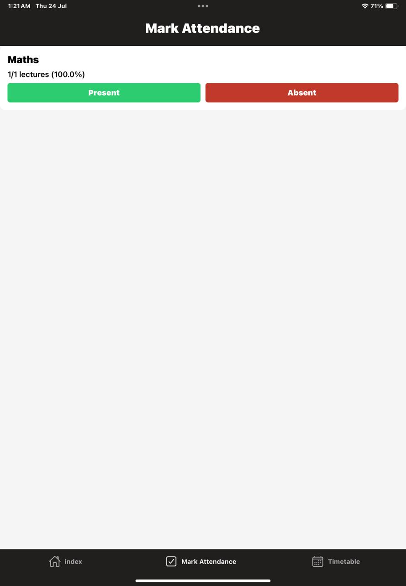
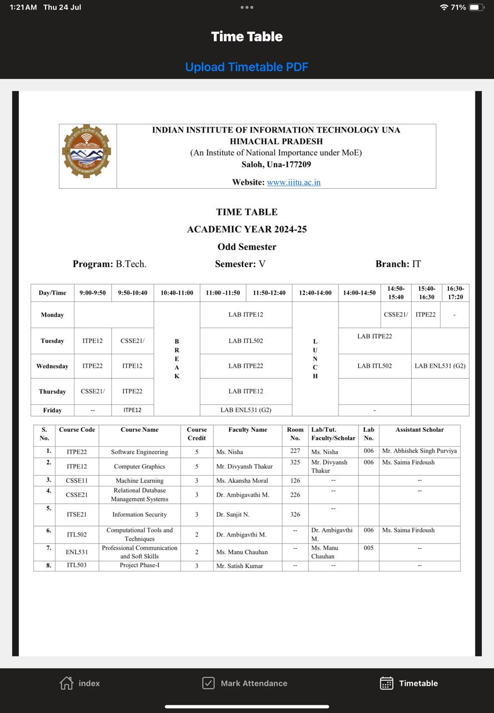

# 📘 Attendance Manager

A mobile-friendly attendance tracking app built with **React Native** and **Node.js**. It allows students to manage subject-wise attendance, mark attendance, and upload/view their timetable as a PDF—all in one place.

---

## 🚀 Features

- 📋 View subjects in a clean table view
- ✅ Mark present or absent for each subject
- 📈 Track attendance percentage
- 🗓️ Upload class timetable in PDF format
- 🔍 Render and view timetable directly inside the app

---

## 🛠 Tech Stack

- **Frontend**: React Native, Expo
- **Backend**: Node.js, Express.js
- **Database**: MongoDB (via Mongoose)
- **PDF Viewer**: `react-native-pdf`, `expo-document-picker`, `react-native-webview`

---

## 📸 Screenshots

_All screenshots are stored in the `/assets` folder._

### 🏠 Home Page – Subject Table


---

### ✅ Mark Attendance



---

### 🗓️ View Timetable (PDF Viewer)



---

## 🔧 Installation

### 1. Clone the Repository

```bash
git clone https://github.com/your-username/attendance-manager.git
cd attendance-manager
